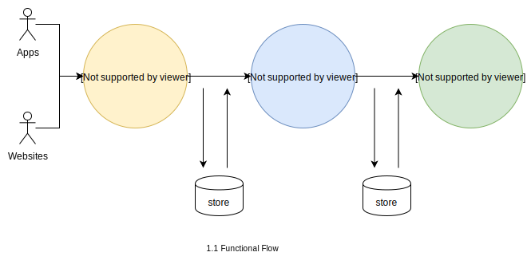

## Requirements:

1. Handle large write volume: Billions write events per day.
2. Handle large read/query volume: Millions merchants want to get insight about their business. Read/Query patterns are time-series related metrics.
3. Provide metrics to customers with at most one hour delay.
4. Run with minimum downtime.
5. Have the ability to reprocess historical data in case of bugs in the processing logic.
	
## Solution:	
This system have three main functional aspects.

**1. Collection:**  
 - A hit is unit of data in analytics. Every user interaction with website or app generates hit request.
 - It gathers all info and meta data associated with that hit and send it to collection server.
 - Collection servers receives all information and store that raw data. 

**2. Processing:**   
- After collecting raw data, processing system will perform aggregation of data based on session, website, time and so on.
- It will create format data according to needs of reports.
- Finally store this formatted data which will be used for reports.

**2. Reporting:** 
- Reporting system will just read data according to required filters.
- It will also take care of requested output format.

#### Technical flow
Above functional flow can be implemented as shown in diagram.

##### Components:

**1. Microservices:**
- Microservice based architecture makes easy to build, maintain and test modules individually.
- Any issue within a particular microservice will not influence entire system.
- System becomes flexible for using technologies and scalability.
- Improves system capability to handle big scale data with speed.

**2. Load balancer:**
- Load balancing above microservice will benefits to run with minimum downtime.
- Failure in a web server will not impact in large amount as traffic will routed to other servers.
- Maintenance, scalability and performance gains are big impacts.

**3. Kubernetes:**
- Kubernetes allows microservices easily scalable, modular, highly available in low cost.
- Development and deployment made easy.

**3. Kafka:**
- Reason to use Kafka broker is its high throughput with low latency.
- Kafka is capable of handling large volume data within range of milliseconds.
- Consumed messages are stored on broker, so it can benefit to replay messages and process historical data again for consumers.
- Messages can be handled in batches and provide high concurrency makes kafka key player of system.

**4. Cassandra:** 
- As cassandra is famous for very high write throughput and good read throughput, it is good choice to store all newly generating raw data at once.
- Highly scalable and highly available with no single point of failure.

**5. Druid:** 
- Timestamp based data storage with high performance querying large data sets makes good choice for fetching reports based on time series.
- Provide aggregation and indexing.
- High availability and high level of data compression reduce storage cost.